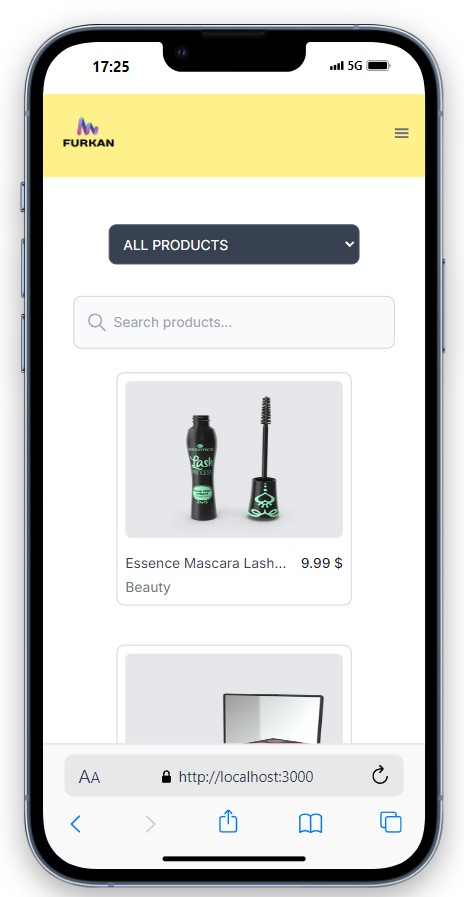
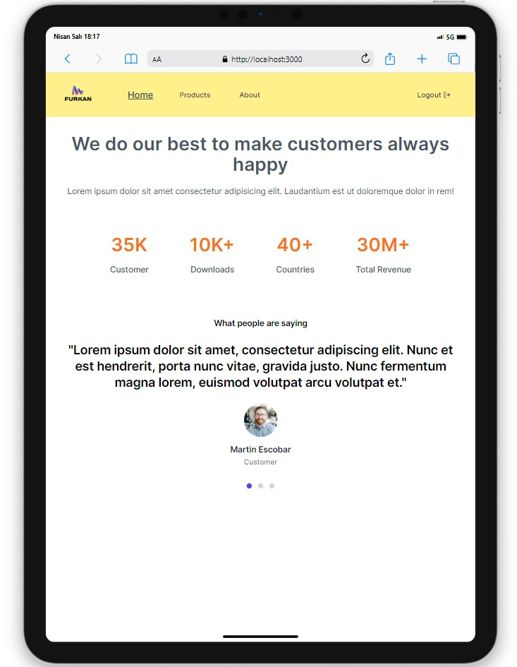
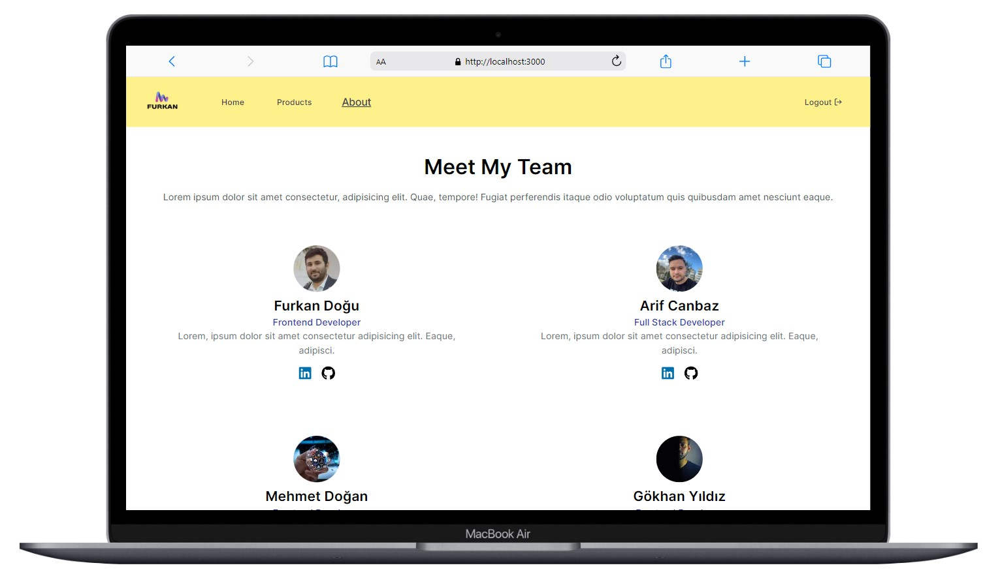

# Furkan Store

<div align="center">
  
</div>

## About the Project

In the project I created with Next JS, after entering the login information, you are directed to a site consisting of home, products, and about pages. On this site, you can explore many products and view additional images of the desired product. The about section contains information about our team, along with links to their GitHub and LinkedIn profiles for further interaction.

## Table of Contents

- [Features](#features)
- [Technologies Used](#technologies-used)
- [Usage](#usage)
- [Project Skeleton](#project-skeleton)
- [Screenshots](#screenshots)

## Live Demo

[Furkan Store](https://furkan-store-with-nextjs.vercel.app/)

## Features

- Logging in with email and password information
- Pagination for smooth transitions between pages.
- Easy product search using the filtering feature.

## Technologies Used

- React
- Axios for API requests
- Next JS
- [DummyJSON API](https://dummyjson.com/) for products data
- Icons from [React Icons](https://react-icons.github.io/react-icons/)
- Styling with [Tailwind](https://tailwindcss.com/) and CSS 
- [Sweetalert2](https://sweetalert2.github.io/) for alert 

## Usage

- When you hover over the email and password fields in the login section, the login email address and password are visible.
- Access detailed information and reviews for each item.
- Use the search function to find specific products.

## Project Skeleton

```
Furkan Store (folder)
│
├── app
│    ├── dashboard
│    │     ├── about
│    │     │    └── page.jsx
│    │     ├── products
│    │     │    ├── [productId]
│    │     │    │      └── page.jsx
│    │     │    └── page.jsx
│    │     ├── layout.jsx
│    │     └── page.jsx
│    ├── global.css
│    ├── layout.js
│    ├── loading.jsx
│    ├── not-found.jsx
│    └── page.js
├── components
│    ├── Navbar.jsx
│    ├── ProductCard.jsx
│    ├── SearchInput.jsx
│    ├── Stats.jsx
│    └── Testimonial.jsx 
├── context
│    ├── AuthContext.jsx
│    └── ProductContext.jsx 
├── helpers
│    └── data.js 
├── puclic
│    └── [images] 
├── .gitignore
├── jsconfig.json
├── next.config.mjs
├── package.json
├── postcss.config.js
├── README.md
├── tailwind.config.js
└── yarn.lock
```

## Screenshots

<div align="center">
  
  
  
</div>

## Compatibility

The project is compatible with both wide-screen computers and mobile devices.

## Acknowledgments

Products data provided by [DummyJSON](https://dummyjson.com/)